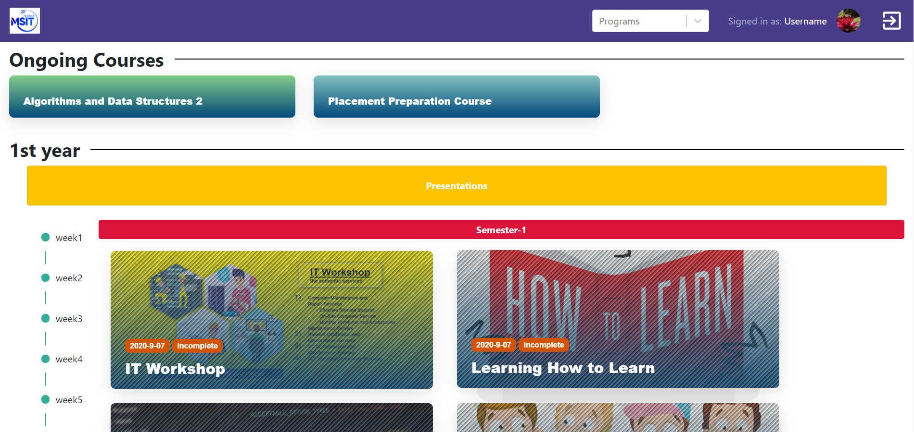
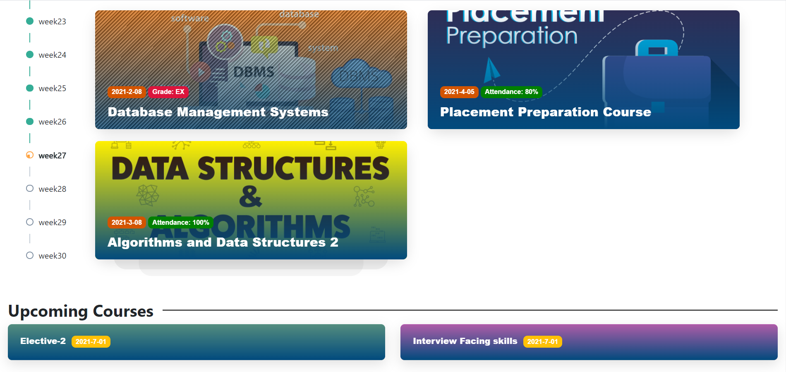

# I-LMS (Intelligent Learning Management System)
We are designing and developing an “Intelligent learning management system” website. We have different pages for mentors and students. 
As if the mentor will be redirected to the respective course page when they click on the mentor. And the student should be able to view the course page directly on login separated by sections. 
Where we have to display the currently ongoing section(Ongoing programs) and the past programs(Completed programs) in another section. The ongoing programs should be on the top of the page.
We have displayed the courses using the cards with a program title, and a dynamic timeline for the courses. We have separated the IT and Soft Skills course using the APIs. IT courses on the left side and Soft Skills courses on the right of the page. The upcoming courses should be visible at the bottom of the page. 
We have separated the courses according to semester-wise. Whereas the completed course remains a blue shade, and the current course will be in the normal shade. We also redirected the logo of MSIT to the home page.
When a student completes a course it should fade out its color. Also when a student hovers on any course card, it should display details like course status, percentage, and grade. When a student/mentor clicks on the start course button it should redirect to the respective course module page.
Users are able to see the course description on page load, able to see the latest module on the top(reverse chronological), and able to see the number of weeks on the left side of the page for quick access. 

## Technologies used:
Postman for API calls. Justinmind for design prototype. React-JS, Bootstrap, JSX, CSS3, HTML.

Packages: Material UI, font awesome, React Icons, cimpress, mui-treasury

## Sprint1:
Designed a sprint work plan using the Justinmind application and understood the scrum process. Understood the issues in the ILMS and in the project management knowing about the UX design and starting implementing it. Learned Justinmind tool, scrum process.

## Sprint2:
Displaying the program page. The mentor should be able to view the program page separated by sections i.e, ongoing and completed. Had difficulty in get JSON data and added dynamically when we click on the card. Learned using Postman for getting API calls.

## Sprint3:
Designed Course page with 3 sections (Onging, Semister, Upcoming) to differentiate easly by student. Display Course page and Mentor page. It should be able to redirect to the respective course page when I click on them and As a student, he should be able to view the course page directly on login(viz. homepage). Faced difficulty in the API’s calls and nodeJs versions are not matching for Nglms and React(i-LMS), Heroku was not working completely. Learned using Json for getting course data.

## Sprint4:
Designed cards UI to display name, picture, Timeline and devoloped the visually. Displaying ongoing courses and divided the courses semester-wise. Display Ongoing courses on the top of the page to access them easily, should be able to see the courses semester-wise along with time duration next to Ongoing Courses and view IT and Soft Skills separated by different color code. Faced difficulty with adding the presentation card as a full-screen card, implementing dynamic cards based on the no. of weeks that course contains. Learned Using Json for getting course data. 

## Sprint5:

## Sprint6:

## Sprint7:

## Getting Started with Create React App

This project was bootstrapped with [Create React App](https://github.com/facebook/create-react-app).

## Available Scripts

In the project directory, you can run:

### `npm start`

Runs the app in the development mode.\
Open [http://localhost:3000](http://localhost:3000) to view it in the browser.

The page will reload if you make edits.\
You will also see any lint errors in the console.

### `npm test`

Launches the test runner in the interactive watch mode.\
See the section about [running tests](https://facebook.github.io/create-react-app/docs/running-tests) for more information.

### `npm run build`

Builds the app for production to the `build` folder.\
It correctly bundles React in production mode and optimizes the build for the best performance.

The build is minified and the filenames include the hashes.\
Your app is ready to be deployed!

See the section about [deployment](https://facebook.github.io/create-react-app/docs/deployment) for more information.

### `npm run eject`

**Note: this is a one-way operation. Once you `eject`, you can’t go back!**

If you aren’t satisfied with the build tool and configuration choices, you can `eject` at any time. This command will remove the single build dependency from your project.

Instead, it will copy all the configuration files and the transitive dependencies (webpack, Babel, ESLint, etc) right into your project so you have full control over them. All of the commands except `eject` will still work, but they will point to the copied scripts so you can tweak them. At this point you’re on your own.

You don’t have to ever use `eject`. The curated feature set is suitable for small and middle deployments, and you shouldn’t feel obligated to use this feature. However we understand that this tool wouldn’t be useful if you couldn’t customize it when you are ready for it.

## Learn More

You can learn more in the [Create React App documentation](https://facebook.github.io/create-react-app/docs/getting-started).

To learn React, check out the [React documentation](https://reactjs.org/).

### Code Splitting

This section has moved here: [https://facebook.github.io/create-react-app/docs/code-splitting](https://facebook.github.io/create-react-app/docs/code-splitting)

### Analyzing the Bundle Size

This section has moved here: [https://facebook.github.io/create-react-app/docs/analyzing-the-bundle-size](https://facebook.github.io/create-react-app/docs/analyzing-the-bundle-size)

### Making a Progressive Web App

This section has moved here: [https://facebook.github.io/create-react-app/docs/making-a-progressive-web-app](https://facebook.github.io/create-react-app/docs/making-a-progressive-web-app)

### Advanced Configuration

This section has moved here: [https://facebook.github.io/create-react-app/docs/advanced-configuration](https://facebook.github.io/create-react-app/docs/advanced-configuration)

### Deployment

This section has moved here: [https://facebook.github.io/create-react-app/docs/deployment](https://facebook.github.io/create-react-app/docs/deployment)

### `npm run build` fails to minify

This section has moved here: [https://facebook.github.io/create-react-app/docs/troubleshooting#npm-run-build-fails-to-minify](https://facebook.github.io/create-react-app/docs/troubleshooting#npm-run-build-fails-to-minify)
